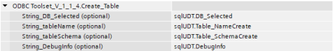

ODBC Toolset for WinCC Unified
========================
## Disclaimer:
```
The examples are non-committal and do not lay any claim to completeness with regard to configuration and equipment as well as any eventualities. The examples do not represent any custom-designed solutions but shall offer only support at typical tasks. You are accountable for the proper mode of the described products yourself.

These examples do not discharge you from the obligation to safe dealing for application, installation, business and maintenance. By use of these examples, you appreciate that Siemens cannot be made liable for possible damages beyond the provisions regarding described above. We reserve us the right to carry out changes at these examples without announcement at any time. The contents of the other documentation have priority at deviations between the suggestions in these examples and other Siemens publications, such as catalogues  
```
## Scope of the librairy:
The library types (script and udt) can be used to create your own SQL-type database server viewer/manager. This uses the tags in the sqlUDT, which you use as arguments in the functions that are defined in the script type library. Arguments must be provided as type string, writing down manually the tag nam. The master copies can be used to have a SQL manager already built.This library has been tested on V18 and V18.1 Unified PC Runtime and Unified Comfort Panels MTP1200, with local SQLEXPRESS and cloud Azure SQL databases, with tables up to 5 columns.

## SQL Server basic assumptions:
Here is the typical SQL server architecture, which is considered by this library:


## ODBC Toolset library types 
### Types > UDT > sqlUDT V1.1.4


This UDT must be created as an HMI Tag called “sqlUDT”, this is mandatory for the scripts function to work.
A datalog called “Trace” must also be created, to have the Query_Log viewer functional.


5 arrays of 100 (0 to 99) WString are also needed in the application. The following is the expected data structure to have in the Unified project:


### Types > Script > ODBC Toolset V1.1.4 


This script contains the following functions:


### List_DB function

The List_DB function uses a List box object to show the results of the query: `` SELECT name FROM master.sys.databasessent`` to the server. Excluders can be included as arguments and they will be excluded from the result set. Selecting entry in the List box results, can write the data to sqlUDT.DB_Selected if desired.


Example of values:


Example of result:


To write the selection to the sqlUDT.DB_Selected you can implement the following on the “Process value > Change” property of the List Box:


Further notes about this function: please create 32 empty entries in the List Box object selection items.

### Create_DB function 

The Create_DB function will create an empty database on the server (specified endpoint), using the following query: ``"CREATE DATABASE "+ dbName.`` You must relist the available databases using the List_DB function afterward to see the newly created DB.


Example of values:


Example of result:


### Delete_DB function

The Delete_DB function will delete the DB from the server specified by the sqlUDT.DB_Selected tag with the following query to the server: ``"DROP DATABASE "+ dbName.`` You must relist the entries with the List_DB function to see changes in the List Box object.


Example of values:


Example of result:


### List_Table function 

The List_Table function uses a List box object to writes the result set of the query ``SELECT name FROM sys.tables`` of the specified selected DB. Selecting entry in the List box results, can write the data to sqlUDT.Table_Selected if desired.


Example of values:


Example of result:


To write the selection to the sqlUDT.Table_Selected you can implement the following on the “Process value > Change” property of the List Box:


Further notes about this function: please create 32 empty entries in the List Box object selection items.

### Create_Table function

The Create_Table function will create a table on the seleced DB, with the name and the schema (column definition), using the following query: ``"CREATE TABLE "+ tableName + " (" + tableColumns + ")"``. You must relist the available tables using the List_Table function afterward to see the newly created DB.


Example of values:



Example of result:


### Delete_Table function 

The Delete_Table function will delete the table from the DB specified by the sqlUDT.Table_Selected tag  with the following query to the server: ``"DROP TABLE "+ tableName``. You must relist the entries with the List_Table function to see changes in the List Box object.


Example of values:


Example of result:


### List_sProc function 

The List_sProc function uses a List box object to writes the result set of the query ``"SELECT SCHEMA_NAME(SCHEMA_ID) AS [Schema], name FROM sys.objects WHERE type = 'P';"`` of the specified selected DB. Selecting entry in the List box results, can write the data to sqlUDT.sProc_Selected if desired.


Example of values:


Example of result:


To write the selection to the sqlUDT.Table_Selected you can implement the following on the “Process value > Change” property of the List Box:


Further notes about this function: please create 32 empty entries in the List Box object selection items.

### Create_sProc function