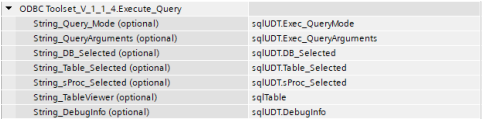
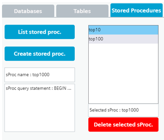

ODBC Toolset for WinCC Unified
========================
# Disclaimer:

>  The examples are non-committal and do not lay any claim to completeness with regard to configuration and equipment as well as any eventualities. The examples do not represent any custom-designed solutions but shall offer only support at typical tasks. You are accountable for the proper mode of the described products yourself.
> 
>  These examples do not discharge you from the obligation to safe dealing for application, installation, business and maintenance. By use of these examples, you appreciate that Siemens cannot be made liable for possible damages beyond the provisions regarding described above. We reserve us the right to carry out changes at these examples without announcement at any time. The contents of the other documentation have priority at deviations between the suggestions in these examples and other Siemens publications, such as catalogues 

# Scope of the librairy
The library types (script and udt) can be used to create your own SQL-type database server viewer/manager. This uses the tags in the sqlUDT, which you use as arguments in the functions that are defined in the script type library. Arguments must be provided as type string, writing down manually the tag nam. The master copies can be used to have a SQL manager already built.This library has been tested on V18 and V18.1 Unified PC Runtime and Unified Comfort Panels MTP1200, with local SQLEXPRESS and cloud Azure SQL databases, with tables up to 5 columns.

# SQL Server basic assumptions
Here is the typical SQL server architecture, which is considered by this library:

# ODBC Toolset library types 
### Types > UDT > sqlUDT V1.1.4

This UDT must be created as an HMI Tag called “sqlUDT”, this is mandatory for the scripts function to work.
A datalog called “Trace” must also be created, to have the Query_Log viewer functional.

5 arrays of 100 (0 to 99) WString are also needed in the application. The following is the expected data structure to have in the Unified project:

| sqlUDT                   | sqlUDT V1.1.4         | Description                                                  |
|-------------------------|--------------|--------------------------------------------------------------|
| endpoint                | WString      | SQL Server IP or DNS name, including SQL name. Eg: 192.168.0.24\SQLEXPRESS |
| user                    | WString      | Username to access the server, that has remote rights.        |
| password                | WString      | Password associated with the username provided.               |
| DB_Selected             | WString      | The Database to work with, in the SQL Server.                 |
| DB_NameCreate           | WString      | Name provided to create a new DB in the SQL Server.           |
| Table_Selected          | WString      | The Table to work with, in the Selected DB.                   |
| Table_NameCreate        | WString      | Name provided to create a new Table in the Selected DB.       |
| Table_SchemaCreate      | WString      | Columns provided to create a new Table in the Selected DB.    |
| sProc_Selected          | WString      | Stored procedure to use in "Exec_Mode = 3" with the Selected DB. |
| sProc_NameCreate        | WString      | Name provided to create a new Stored procedure in the Selected DB |
| sProc_QueryCreate       | WString      | Store procedure "query statement" to be run with the provided NameCreate. |
| Exec_QueryMode          | UInt         | Mode 0: Free query ; Mode 1: Select ; Mode 2: Insert into ; Mode 3: Execute |
| Exec_QueryArguments     | WString      | Field to fill up the rest of the statement in regards to the mode used. |
| DebugInfo               | WString      | To display script debug info (traces) to view in the application. |
| Query_Log               | WString      | This will be logged in the Trace datalog archive, with the queryLogger function (library script) |
| Selected_Row            | WString      | This shows the value of the selected row from the sqlTable viewer. |
| column1                 | Array [0..99] of WString | Column1 data – result from the query                         |
| column2                 | Array [0..99] of WString | Column2 data – result from the query                         |
| column3                 | Array [0..99] of WString | Column3 data – result from the query                         |
| column4                 | Array [0..99] of WString | Column4 data – result from the query                         |
| column5                 | Array [0..99] of WString | Column5 data – result from the query                         |

### Types > Script > ODBC Toolset V1.1.4 

This script contains the following functions:

| ODBC Toolset             | V1.1.4                                                                                                                                                                   |
|--------------------|--------------------------------------------------------------------------------------------|
| Global definition   | Contains internal functions: initCreds, clearEntries, tableData, queryLogger                |
| List_DB             | Sends to a List box object, the available DB in the server                                   |
| Create_DB           | Creates a DB in the server                                                                 |
| Delete_DB           | Deletes the selected DB in the server                                                      |
| List_Table          | Sends to a List box object, the available Tables in the selected DB                           |
| Create_Table        | Creates a Table in the DB                                                                  |
| Delete_Table        | Deletes selected Tables in the selected DB                                                 |
| List_sProc          | Sends to a List box object, the available stored procedures in the selected DB                |
| Create_sProc        | Creates a stored procedure in the selected DB                                              |
| Delete_sProc        | Deletes the selected stored procedure in the selected DB                                    |
| Execute_Query       | Sends a query to the server based on the selected DB, Table, or stored procedure and forwards the results to a Table CWC object |
| TableViewerSchema   | Shapes the Table CWC object with selected table columns                                     |

### List_DB function

The List_DB function uses a List box object to show the results of the query: `` SELECT name FROM master.sys.databasessent`` to the server. Excluders can be included as arguments and they will be excluded from the result set. Selecting entry in the List box results, can write the data to sqlUDT.DB_Selected if desired.

| Parameter            | Arguments description                                               |
|-----------------------|-----------------------------------------------------------|
| String_dbList         | Mandatory, it’s the List Box object name in type String.  |
| String_Excluder_1     | Optional, if you want to exclude DB’s from the results, type string. |
| String_Excluder_2     | Optional, if you want to exclude DB’s from the results, type string. |
| String_Excluder_3     | Optional, if you want to exclude DB’s from the results, type string. |
| String_Excluder_4     | Optional, if you want to exclude DB’s from the results, type string. |
| String_DebugInfo      | Optional, name of the tag for the Debug Info to be shown in RT. |

Example of values:

Example of result:

To write the selection to the sqlUDT.DB_Selected you can implement the following on the “Process value > Change” property of the List Box:

Further notes about this function: please create 32 empty entries in the List Box object selection items.

### Create_DB function 

The Create_DB function will create an empty database on the server (specified endpoint), using the following query: ``"CREATE DATABASE "+ dbName.`` You must relist the available databases using the List_DB function afterward to see the newly created DB.

| Parameter          | Arguments description                                                        |
|---------------------|--------------------------------------------------------------------|
| String_dbName       | Mandatory, it expects the tag `sqlUDT.DB_NameCreate`, in type String. |
| String_DebugInfo    | Optional, name of the tag for the Debug Info to be shown in RT.      |

Example of values:

Example of result:

### Delete_DB function

The Delete_DB function will delete the DB from the server specified by the sqlUDT.DB_Selected tag with the following query to the server: ``"DROP DATABASE "+ dbName.`` You must relist the entries with the List_DB function to see changes in the List Box object.

| Parameter              | Arguments description                                                          |
|-------------------------|----------------------------------------------------------------------|
| String_DB_Selected      | Mandatory, it expects the tag `sqlUDT.DB_Selected`, in type String.  |
| String_DebugInfo        | Optional, name of the tag for the Debug Info to be shown in RT.      |

Example of values:

Example of result:

### List_Table function 

The List_Table function uses a List box object to writes the result set of the query ``SELECT name FROM sys.tables`` of the specified selected DB. Selecting entry in the List box results, can write the data to sqlUDT.Table_Selected if desired.

| Parameter            | Arguments description                                                          |
|-----------------------|----------------------------------------------------------------------|
| String_tableList      | Mandatory, it’s the List Box object name in type String.             |
| String_DB_Selected    | Mandatory, it expects the tag `sqlUDT.DB_Selected`, in type String.  |
| String_DebugInfo      | Optional, name of the tag for the Debug Info to be shown in RT.      |

Example of values:

Example of result:

To write the selection to the sqlUDT.Table_Selected you can implement the following on the “Process value > Change” property of the List Box:

Further notes about this function: please create 32 empty entries in the List Box object selection items.

### Create_Table function

The Create_Table function will create a table on the seleced DB, with the name and the schema (column definition), using the following query: ``"CREATE TABLE "+ tableName + " (" + tableColumns + ")"``. You must relist the available tables using the List_Table function afterward to see the newly created DB.

| Parameter            | Arguments description                                                          |
|-----------------------|----------------------------------------------------------------------|
| String_DB_Selected    | Mandatory, it expects the tag `sqlUDT.DB_Selected`, in type String.  |
| String_tableName      | Mandatory, it expects the tag `sqlUDT.Table_NameCreate`, in type String.  |
| String_tableSchema    | Mandatory, it expects the tag `sqlUDT.Table_SchemaCreate`, in type String.  |
| String_DebugInfo      | Optional, name of the tag for the Debug Info to be shown in RT.      |

Example of values:

Example of result:

### Delete_Table function 

The Delete_Table function will delete the table from the DB specified by the sqlUDT.Table_Selected tag  with the following query to the server: ``"DROP TABLE "+ tableName``. You must relist the entries with the List_Table function to see changes in the List Box object.

| Parameter               | Arguments description                                                           |
|--------------------------|-----------------------------------------------------------------------|
| String_DB_Selected       | Mandatory, it expects the tag `sqlUDT.DB_Selected`, in type String.   |
| String_Table_Selected    | Mandatory, it expects the tag `sqlUDT.Table_Selected`, in type String. |
| String_DebugInfo         | Optional, name of the tag for the Debug Info to be shown in RT.       |

Example of values:

Example of result:

### List_sProc function 

The List_sProc function uses a List box object to writes the result set of the query ``"SELECT SCHEMA_NAME(SCHEMA_ID) AS [Schema], name FROM sys.objects WHERE type = 'P';"`` of the specified selected DB. Selecting entry in the List box results, can write the data to sqlUDT.sProc_Selected if desired.

| Parameter            | Arguments description                                                          |
|-----------------------|----------------------------------------------------------------------|
| String_sProcList      | Mandatory, it’s the List Box object name in type String.             |
| String_DB_Selected    | Mandatory, it expects the tag `sqlUDT.DB_Selected`, in type String.  |
| String_DebugInfo      | Optional, name of the tag for the Debug Info to be shown in RT.      |

Example of values:

Example of result:

To write the selection to the sqlUDT.Table_Selected you can implement the following on the “Process value > Change” property of the List Box:

Further notes about this function: please create 32 empty entries in the List Box object selection items.

### Create_sProc function

The Create_sProc function will create a stored procedure on the seleced DB, with the name and the query to be stored, using the following query: ``"CREATE PROCEDURE " + sProcName + " AS " + sProcQuery`` . You must relist the available tables using the List_sProc function afterward to see the newly created DB.

| Parameter                  | Arguments description                                                           |
|-----------------------------|-----------------------------------------------------------------------|
| String_DB_Selected         | Mandatory, it expects the tag `sqlUDT.DB_Selected`, in type String.   |
| String_sProc_NameCreate     | Mandatory, it expects the tag `sqlUDT.sProc_NameCreate`, in type String. |
| String_sProc_QueryCreate    | Mandatory, it expects the tag `sqlUDT.sProc_QueryCreate`, in type String. |
| String_DebugInfo            | Optional, name of the tag for the Debug Info to be shown in RT.       |

Example of values:

Example of result:

### Delete_sProc function 

The Delete_sProc function will delete the stored procedure from the DB specified by the sqlUDT.DB_Selected tag with the following query to the server: ``"DROP PROCEDURE " + selectedProc``. You must relist the entries with the List_sProc function to see changes in the List Box object.

| Parameter                   | Arguments description                                                          |
|-----------------------------|----------------------------------------------------------------------|
| String_DB_Selected          | Mandatory, it expects the tag `sqlUDT.DB_Selected`, in type String.  |
| String_sProc_Selected       | Mandatory, it expects the tag `sqlUDT.Table_Selected`, in type String. |
| String_DebugInfo             | Optional, name of the tag for the Debug Info to be shown in RT.      |

Example of values:

Example of result:

### Execute_Query function

The Execute_Query function will use the selected mode, where:

| Modes | Description                                            |
|-------|--------------------------------------------------------------------|
| 0     | Free query, query = queryArg + ";"                               |
| 1     | SELECT, query = "SELECT " + queryArg + " FROM " + selectedTable + ";" |
| 2     | INSERT, query = "INSERT INTO " + selectedTable + " VALUES (" + queryArg + ")" + ";" |
| 3     | EXECUTE, query = "EXECUTE " + selectedProc + ";"                 |

It’s needed to complete the function with mandatory function parameters, as follows:

| Parameter                | Argumetns description                                                            |
|---------------------------|------------------------------------------------------------------------|
| String_Exec_QueryMode     | Mandatory, it expects the tag `sqlUDT.Exec_QueryMode`, in type String. |
| String_QueryArguments     | Mandatory, it expects the tag `sqlUDT.Exec_QueryArguments`, in type String. |
| String_DB_Selected        | Mandatory, it expects the tag `sqlUDT.DB_Selected`, in type String.    |
| String_Table_Selected     | Mandatory, it expects the tag `sqlUDT.Table_Selected`, in type String. |
| String_sProc_Selected      | Mandatory, it expects the tag `sqlUDT.sProc_Selected`, in type String.  |
| String_TableViewer         | Mandatory, it’s the Table CWC object name in type String.              |
| String_DebugInfo           | Optional, name of the tag for the Debug Info to be shown in RT.        |

Example of values:

Example of result (mode 1):

# ODBC Toolset library master copies 
This part will cover the master copies information and engineering.

### Data / tag structure

In the demo project, there’s a tag table called “sql”, where you have the following variables:

| sqlUDT          | sqlUDT V 1.1.4              | Description                                                                         |
|---------------------|-----------------------------|---------------------------------------------------------------------------------|
| endpoint            | WString                     | SQL Server IP or DNS name, including SQL name. Eg: 192.168.0.24\SQLEXPRESS      |
| user                | WString                     | Username to access the server, that has remote rights.                          |
| password            | WString                     | Password associated with the username provided.                                |
| DB_Selected         | WString                     | The Database to work with, in the SQL Server.                                   |
| DB_NameCreate       | WString                     | Name provided to create a new DB in the SQL Server.                             |
| Table_Selected      | WString                     | The Table to work with, in the Selected DB.                                     |
| Table_NameCreate    | WString                     | Name provided to create a new Table in the Selected DB.                         |
| Table_SchemaCreate  | WString                     | Columns provided to create a new Table in the Selected DB.                      |
| sProc_Selected      | WString                     | Stored procedure to use in "Exec_Mode = 3" with the Selected DB.               |
| sProc_NameCreate    | WString                     | Name provided to create a new Stored procedure in the Selected DB.             |
| sProc_QueryCreate   | WString                     | Store procedure "query statement" to be run with the provided NameCreate.      |
| Exec_QueryMode      | UInt                        | Mode 0: Free query ; Mode 1: Select ; Mode 2: Insert into ; Mode 3: Execute     |
| Exec_QueryArguments | WString                     | Field to fill up the rest of the statement in regards to the mode used.         |
| DebugInfo           | WString                     | To display script debug info (traces) to view in the application.              |
| Query_Log           | WString                     | This will be logged in the Trace datalog archive, with the queryLogger function (library script) |
| Selected_Row        | WString                     | This shows the value of the selected row from the sqlTable viewer.              |
| column1             | Array [0..99] of WString    | Column1 data – result from query                                                |
| column2             | Array [0..99] of WString    | Column2 data – result from query                                                |
| column3             | Array [0..99] of WString    | Column3 data – result from query                                                |
| column4             | Array [0..99] of WString    | Column4 data – result from query                                                |
| column5             | Array [0..99] of WString    | Column5 data – result from query                                                |

The following will explain how these tags are used per functionality.

### Setup panel 

Tag used:

| Tag                    | Description                                                          |
|------------------------|----------------------------------------------------------------------|
| sqlUDT.endpoint        | SQL Server IP or DNS name, including SQL name. Eg: 192.168.0.24\SQLEXPRESS |
| sqlUDT.user            | Username to access the server, that has remote rights.               |
| sqlUDT.password        | Password associated with the username provided.                      |

### Execute panel

Tag used:

| Tag                               | Description                                                          |
|-----------------------------------|----------------------------------------------------------------------|
| sqlUDT.Exec_QueryMode             | Mode 0: Free query ; Mode 1: Select ; Mode 2: Insert into ; Mode 3: Execute |
| sqlUDT.Exec_QueryArguments        | Field to fill up the rest of the statement in regards to the mode used. |

Available modes (see Examples chapter at the end):

| Modes | Description                                            |
|-------|--------------------------------------------------------------------|
| 0     | Free query, query = queryArg + ";"                               |
| 1     | SELECT, query = "SELECT " + queryArg + " FROM " + selectedTable + ";" |
| 2     | INSERT, query = "INSERT INTO " + selectedTable + " VALUES (" + queryArg + ")" + ";" |
| 3     | EXECUTE, query = "EXECUTE " + selectedProc + ";"                 |

### Database panel

List, create and delete DB on the server.

### Tables panel

List, create and delete Tables on the DB.

### Stored Procedures panel

List, create and delete Stored Procedures on the DB.

### SQL Table viewer panel

Result set of the Execute Query is send to this Table CWC. Sorting columns and selection of rows are possible. Also, the selected row data will be passed to the tag sqlUDT.Selected_Row, on the Table CWC event “SelectedRow”. The selected row data is a JavaScript object, to easily return specific data from selection. In the demo project, the whole object is parsed as a string to be returned. The Index is a manual-made column by the library, it refers to the array index of the tag that is assigned. For example, column1[1] tag value would be “dominic” and column2[2] would be “35”.

### Logger viewer panel

The logger panel is a Process Control object that reads last hour of the sqlUDT.Query_Log:Query_Log of the Trace log.

### Infobar

The infobar display two things:

`DebugInfo, with the tag sqlUDT.DebugInfo.`

`Selected row data, with the tag sqlUDT.Selected_Row.`

# Project engineering information

### User administration

|   Default user/password         |                           |
|------------|---------------------------|
| User       | admin                     |
| Password   | Admin123                  |

### Runtime settings

Make sure that at least, you activated the Storage systems:

`Tag persistency`

`Tag logging`

### Tag counts

The whole application example will use 539 tags internal) and 1 logging tag (query logger).

### Type script library

The whole library doesn’t have any know-how protection, it’s freely editable and shared as "Open-Source" example.

### Screen ODBC Toolset

This screen is mandatory to have if you want to use the master copies. It’s a design based on the HMI Template Suite, which provides intuitive design to manage a SQL server.

### Screen Column Array

This screen is optional. It’s only a set of I/O Fields to display data from the result set of the query sent to the DB. It represents the 5 arrays of 100 elements column1-5 in a screen.

# Revision history

Here’s a quick recap of the revision history of the ODBC Toolset.

| Date      | Version | Description                                                   |
|-----------|---------|---------------------------------------------------------------|
| 25/09/23  | V1.2    | Improve UI for tables and procedures creation schema.        |
|           |         | Added auto-refresh of lists upon deletion and creation.       |
|           |         | Added confirmation popup for deleting DB, tables, and procedures. |
| 21/07/23  | V1.1    | Added stored procedures list/create/delete/execute.           |
|           |         | Standardized all the functions into a Script type.            |
|           |         | Standardized the tags into a UDT type.                        |
|           |         | Created a new demo project with enhanced UI.                  |
|           |         | Added master copies (screens and tag table).                  |
| 15/04/23  | V1.0    | Public release demo project of ODBC Toolset.                 |
